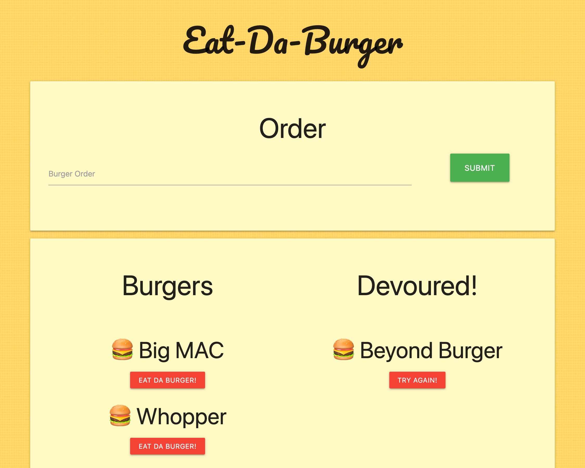

# Eat-da-burger

  ## Description

  A fun burger ordering app! The user can order any burger they like. The burger will be saved in their burger queque and moved to the devoured side when the user clicks eat-da-burger! This is a Heroku app build with node.js.

  [🍔 Launch App](https://burger-app-rluna.herokuapp.com/) 

  ## Table of Contents

  * [Image](#image)
  * [Technologies](#technologies)
  * [Known-Bugs](#known-bugs)
  * [Next-Steps](#next-steps)
  * [License](#license)
  * [Contact](#contact)
  * [Links](#links)

  ## Image

  

  ## Technologies
  
  * HTML
  * CSS
  * Javascript
  * Node.js
  * Express
  * Handlebars
  * MySQL
  * JawsDB
  * Heroku

  ## Known-Bugs

  Possible bug in loading the database without seed data.

  ## Next-Steps

  * New styling/UI
  * Delete burger option

  ## License

  This project is licensed under the [MIT](https://opensource.org/licenses/MIT) license.
  

  ## Contact

  Author: Ray Luna 

  If you have any questions about the repo, open an issue or contact me directly at:
  - E-Mail: leon.luna.ray@gmail.com
  - GitHub: [leon-luna-ray](https://github.com/leon-luna-ray)

  ## Links

  - [Deployed Project](https://burger-app-rluna.herokuapp.com/) 

  - [Project Repository](https://github.com/leon-luna-ray/burgers-app/)

  